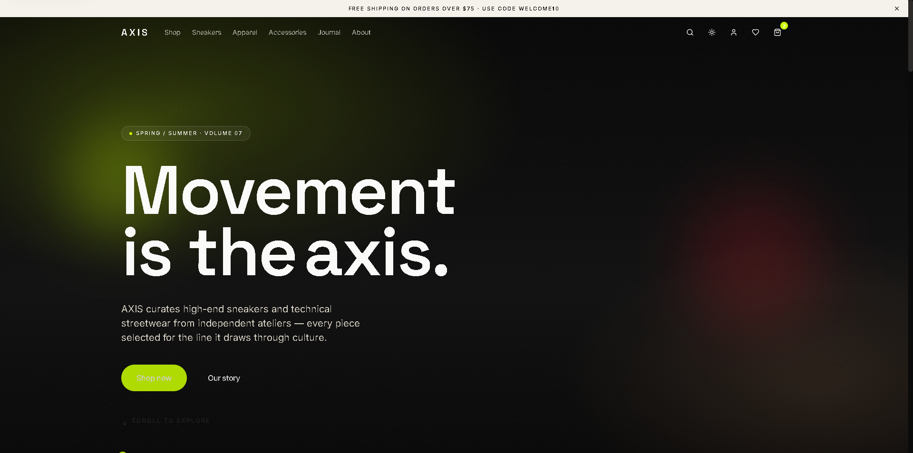
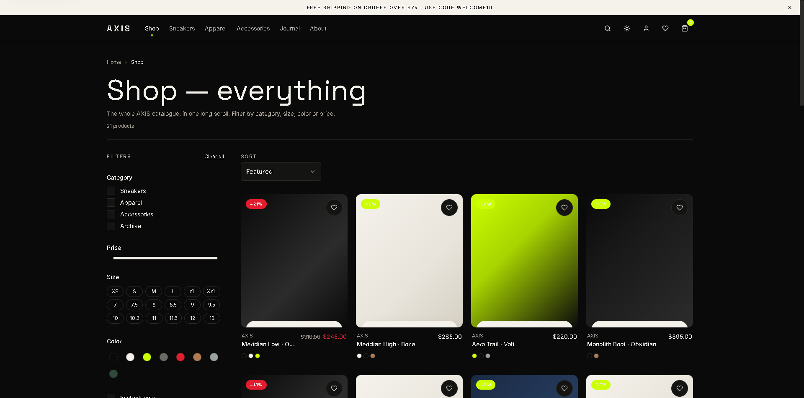

# AXIS — Sneakers & Streetwear E‑commerce

High-end, production-grade e-commerce storefront built with Next.js 14 (App Router), TypeScript (strict), Tailwind CSS, Framer Motion, Zustand, React Hook Form + Zod, TanStack Query and Lenis smooth scroll.

> _Movement is the axis._

## Preview

<div align="center">
  
  
</div>


## Live preview

- Website: https://axis-commerce.vercel.app

## Credits

- Created by [CaioXDeveloper](https://github.com/CaioXDeveloper)
- Portfolio: [https://port-caiox.vercel.app/](https://port-caiox.vercel.app/)

## Quick start

```bash
npm install
npm run dev     # http://localhost:3000
npm run build   # production build (98 routes)
npm run typecheck
npm run lint
```

## Tech stack

- **Framework** · Next.js 14.2 App Router · TypeScript 5.4 (strict, `noImplicitAny`)
- **UI** · Tailwind CSS 3.4 with a full custom design system (brand / neutral / accent / semantic 50–950 scales), fluid typography via `clamp()`, dark mode via `next-themes`
- **Animations** · Framer Motion 11 + Lenis smooth scroll; full `prefers-reduced-motion` respect
- **State** · Zustand with `persist` middleware for cart & wishlist (localStorage)
- **Forms** · React Hook Form + Zod (every form with inline validation + error states)
- **Data** · 21 products, 8 reviews, 3 journal articles in `lib/mock-data.ts`
- **API** · Route handlers in `app/api/*` with Zod validation on every input

## What's in the build

**98 routes** — see `npm run build` output. Highlights:

- `/` — full marketing homepage (hero with split-word reveal + mouse parallax, featured categories, brand statement, featured products, best sellers row, testimonials marquee, instagram grid, newsletter, trust badges, footer)
- `/shop` + `/shop/[category]` — URL-driven filters (categories, price range slider, size pills, color swatches, in-stock toggle), live sort, responsive 2→3→4 grid, mobile filter drawer, empty state
- `/product/[slug]` — image gallery with hover zoom + thumbnails, variant selectors with stock awareness, stock indicator, quantity selector, wishlist, size guide modal, Product JSON-LD schema, accordion description/care/shipping, reviews with distribution bars, related row
- `/cart` — two-column layout, line-item quantity selector with animated number transitions, promo code with feedback, free-shipping progress bar, upsell row
- `/checkout` → `/checkout/shipping` → `/checkout/payment` — 3-step flow, progress bar, back navigation, draft persisted to localStorage, RHF + Zod validation, dedicated minimal layout
- `/order-confirmed` — SVG path-draw checkmark animation, order summary, tracking number placeholder
- `/account` + `/orders` + `/orders/[id]` + `/addresses` + `/settings` — sidebar layout, order status badges, delete-address confirm modal, settings form with password change + account deletion modal
- `/admin` + `/admin/products` + `/admin/products/[id]` + `/admin/orders` + `/admin/orders/[id]` + `/admin/customers` + `/admin/content` + `/admin/discounts` + `/admin/settings` — full admin workspace with dashboard KPIs, catalog operations, order management, customer segmentation, content and promo controls
- `/login` + `/register` + `/forgot-password` — centered card layout, social login UI, success state
- `/about` + `/journal` + `/journal/[slug]` + `/sustainability` + `/contact`
- API: `/api/products`, `/api/products/[slug]`, `/api/search`, `/api/cart`, `/api/orders`, `/api/newsletter`

## Design tokens

- **Obsidian** `#0A0A0A` — foreground / primary
- **Bone** `#F5F2EC` — background / warm off-white
- **Volt** `#CCFF00` — accent / CTAs / badges
- **Ash** `#6B6B66` — warm neutral
- **Ember** `#E11D2E` — sale / destructive

Fonts: `Inter` (sans UI) + `Space Grotesk` (display headlines) via `next/font/google`.

## Accessibility

- WCAG AA focus ring (`focus-visible` accent outline) on every interactive element
- Modal & Drawer: Escape to close, scroll lock, labelled by `aria-modal`/`aria-labelledby`
- Skip-to-main-content link (visually hidden, focus-visible)
- Live regions on cart count; aria-pressed on toggles; labels & aria-describedby on every input
- `useReducedMotion()` gating + CSS fallback for users who prefer reduced motion

## Notes for production

- Wire real payments (Stripe), sessions, rate limiting and CSRF — markers left in `app/api/orders/route.ts` and `app/api/newsletter/route.ts`
- Replace mock data in `lib/mock-data.ts` with a CMS/DB; revalidation tags are ready to add in `next.config.mjs` and route handlers
- Add `next-sitemap` for XML sitemap + robots.txt

## Known placeholders

- No external image URLs — every visual is a CSS gradient placeholder, inline SVG, or Lucide icon. Swap with real `next/image` assets when the photoshoot lands.
- Auth is UI-only. Social login / password flows don't call real providers.
